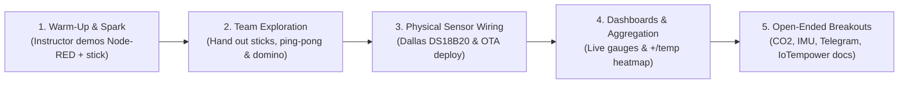

# Instructor Guide: Mastering IoT Solutions Workshop (2–3 h)

[← Back to Workbook (README.md)](./README.md) | [Workshop Overview & Syllabus](./workshop-overview.md)

This guide provides operational guidance for instructors and lab assistants delivering the **Mastering IoT Solutions** workshop.

---

## 1. Didactical Approach & Core Principles



### Core Didactical Principle: Hardware-First, Zero-Install
Participants do **not** spend the first hour installing drivers, toolchains, or Python environments.
- Microcontrollers (**M5StickC**) are pre-provisioned using [IoTempower](https://iotempower.us).
- Teams log into pre-configured **Node-RED** containers hosted on the instructor's laptop.
- Within 10–15 minutes of entering the room, participants are triggering MQTT messages and seeing physical hardware react.

### Organic Cadence (~90 Minutes Baseline + Open Exploration)
Avoid rigid time blocks or artificial school bells. Treat the workshop as an **organic, hands-on arc**:
- **Pacing is team-driven:** Teams pair up (one driver at the keyboard, one navigator with the workbook/notes). Faster teams can progress ahead into open-ended challenges, while teams needing wiring assistance receive immediate coaching.
- **On-Demand Explanations:** Do not front-load heavy lectures on MQTT protocols, packet headers, or broker architectures. Demonstrate the effect first; explain the mechanism when curiosity peaks or when students ask questions.

---

## 2. Hardware & Infrastructure Checklist

### Per Team (Pairs or Trios, up to 15 Teams)
- **1× M5StickC / M5StickC Plus / Plus2** (pre-flashed, labeled `01`–`15`).
- **1× USB-C cable** (for power from student laptop or USB strip).
- **1× Dallas DS18B20 Temperature Sensor module** with 3 DuPont female-to-female jumper wires.
- *(Optional for fast teams)* **1× Sensirion SCD4x CO2/temp/humidity sensor** (Grove connector).

### Instructor Station
- **1× Dedicated Wi-Fi Access Point / Router:**
  - *Strongly Recommended:* A dedicated hardware router (e.g. **GL-iNet GL-B1300**) broadcasting:
    - `iotempire-b1300-5g` (5 GHz, for participant laptops)
    - `iotempire-b1300` (2.4 GHz, for M5StickC nodes and non-5G devices)
    - Password for both: **`iotempire`**
  - *Network Note on Linux Hotspots:* Running a software AP on a laptop for 20+ clients is prone to dropouts under Linux unless using specialized Atheros or older Realtek USB network cards (the only chipsets handling dense multi-client traffic reliably). A dedicated external router avoids Wi-Fi congestion entirely.
- **1× Instructor Laptop:**
  - Container engine: **Podman** (rootless) or **Docker**.
  - **IoTempower** framework installed (`iot` CLI in path, see [iotempower.us](https://iotempower.us)).
  - HDMI connection to projector.
  - 1× Instructor M5StickC (e.g. labeled `00`) for live demonstration.

---

## 3. Pre-Workshop Setup & Fleet Provisioning

### Understanding IoTempower Node Architecture
In IoTempower, each node directory is self-contained and needs only two minimal files:
1. **`node.conf`**: Specifies the hardware target (e.g. `board="m5stickc plus2"` or `board="wemos"`).
2. **`setup.cpp`**: Specifies the connected devices in simple, fluent C++:
   ```cpp
   const char* id="01";
   out(led, ONBOARDLED).inverted().off();
   button(home, BUTTON_HOME, "pressed", "released").inverted().debounce(10);
   button(buttom, BUTTON_RIGHT, "pressed", "released").inverted().debounce(10);
   m5stickc_display(console, 2, 270);
   m5stickc_imu(imu, true, true, false, false);
   //ds18b20(temp, 26);
   //scd4x(gas).i2c(26,0);
   ```
The parent directory contains **`system.conf`** with the workshop Wi-Fi credentials (`iotempire-b1300`, password `iotempire`) and MQTT broker IP (`_gateway`).

### Provisioning the Sticks via USB (Initial Flash)

1. Open a terminal and enter the workshop tools directory:
   ```bash
   cd workshops/mastering-iot-solutions/instructor-tools
   ```
2. Verify `stick-config/system.conf` matches your workshop Wi-Fi (`iotempire-b1300` / `iotempire`) and broker IP.
3. If node folders `01` through `15` are not yet created, generate them:
   ```bash
   ./generate-sticks.sh 15 "m5stickc plus2"
   ```
4. Enter the IoTempower environment:
   ```bash
   iot
   ```
   *(This launches the IoTempower subshell with all tools loaded).*
5. Navigate into the specific node directory and flash via USB:
   ```bash
   cd stick-config/01
   deploy serial
   ```
   *(Shortcut from outside the subshell: `iot x deploy serial`).*
   Repeat for each stick (`02`, `03`, ...). Once initially flashed and connected to Wi-Fi, **all future firmware updates are done Over-The-Air (OTA) without USB!**

### Launching the Infrastructure & Node-RED Containers

1. **Start MQTT Broker via IoTempower Service:**
   IoTempower manages background services cleanly via `iot service`:
   ```bash
   iot service start --mqtt
   ```
   *(We select `--mqtt` explicitly; `--web` is not needed because Node-RED runs in container instances).*
2. **Start Multi-Tenant Node-RED Containers:**
   ```bash
   ./start-nodered-containers.sh start --count 15 --base-port 1801
   ```
   This creates `nodered-1` on port `1801`, `nodered-2` on port `1802`, etc., with `@flowfuse/node-red-dashboard` pre-installed.
3. **Monitor Live MQTT Traffic:**
   IoTempower provides the built-in `mqtt_listen` command:
   ```bash
   # From within IoTempower subshell:
   mqtt_listen
   # Or directly from bash:
   iot x mqtt_listen
   ```
   *(Tip: When called from inside a node directory like `stick-config/01`, `mqtt_listen` automatically filters and shows only topics belonging to that node!).*

---

## 4. Workshop Conductor Flow (~90 Min Baseline)

### Stage 1: Warm-Up & Instructor Live Spark (~15 min)
1. **Brief Welcome (5 min):**
   - Quick hands-up poll: Who has done programming? Who has touched microcontrollers?
   - The democratization of hardware: William Hooi, 'Espresso Lite', and how low-cost Wi-Fi MCUs transformed maker culture and engineering.
2. **Rapid Crowd-Sourcing (5 min):**
   - Ask teams to spend 3 minutes searching/thinking: 1 challenge, 3 domains, 2 protocols, 2 devices, 1 definition.
   - Collect keywords rapidly on the board.
3. **Instructor Live Spark (5 min on Projector):**
   - Open Node-RED on the beamer.
   - Wire an **inject** node to a **debug** node -> click Deploy -> trigger payload.
   - Show how to send a message to the **instructor's M5StickC**:
     - Inject `"toggle"` -> `mqtt out` to topic `00/led/set` -> **The stick's red LED flips live!**
     - Inject `"Welcome!"` -> `mqtt out` to topic `00/console/set` -> **Text appears on the stick's screen!**
   - Hand out the numbered sticks to the student teams. The room is now buzzing and eager to try!

### Stage 2: Team Exploration & The Domino Chain (~25 min)
1. **Teams Log In:**
   - Display the Wi-Fi credentials and the container access table on the projector:
     - Wi-Fi: `iotempire-b1300-5g` (password: `iotempire`).
     - URL: `http://<instructor-host>:18nn/` (or `http://<host-ip>:18nn/`).
     - Credentials: `admin` / Password from table.
2. **Team Hands-On:**
   - Teams follow [Phase 2 of the Workbook](./README.md#%EF%B8%8F-phase-2-interacting-with-your-m5stickc) (or oral guidance).
   - Listen to `<id>/home` -> watch button presses in debug sidebar.
   - Toggle their own LED via `<id>/led/set`.
   - Print custom team names or messages to `<id>/console/set`.
3. **The Cross-Stick Domino Wave:**
   - Prompt teams to wire their button to toggle their neighbor's LED (`02/led/set`, `03/led/set`, etc.).
   - Trigger a collective chain reaction across all desks!
   - *Educational moment (On-Demand):* When students ask how messages travel, explain the **MQTT publish/subscribe star topology** and topic hierarchy.

### Stage 3: Adding Physical Sensors & Live OTA Deploy (~25 min)
1. Hand out the **Dallas DS18B20** temperature sensor modules and jumpers.
2. Guide wiring to the top HAT header:
   - `GND` -> `GND`
   - `5V` -> `5V`
   - `DATA` -> `G26`
3. **The IoTempower OTA Moment:**
   - Show the code on the projector: in `setup.cpp`, uncommenting one line:
     ```cpp
     ds18b20(temp, 26);
     ```
   - In the terminal, run the Over-The-Air deployment:
     ```bash
     cd stick-config/01
     iot x deploy
     ```
     *(Note: `deploy` is relative to the current directory—no path argument is passed. If run in `stick-config/`, it performs a multi-deploy across all subdirectories!).*
   - Point to the stick: it compiles, downloads the new binary over Wi-Fi, and reboots in seconds without touching the USB cable!
   - Students immediately see temperature readings arriving in Node-RED on `<id>/temp`.

### Stage 4: Dashboards & Room Aggregation (~25 min)
1. Teams add **ui-gauge** and **ui-chart** nodes in Node-RED.
2. Open the dashboard at `http://<instructor-host>:18nn/dashboard/`.
3. Teams pinch the sensor to watch live temperature rise.
4. **Classroom Heatmap:**
   - Show the wildcard subscription `+/temp`.
   - Everyone sees the entire classroom's temperature profile live on a single chart.

---

## 5. Spontaneous Breakouts & Open Exploration

For fast teams, 3-hour editions, or open labs, encourage teams to pick an exploration path:

- **Sensirion SCD4x CO2 Sensor:** Wire SDA to `G26`, SCL to `G0`. Uncomment `scd4x(gas).i2c(26,0);` and run `iot x deploy`. Build a ventilation warning system in Node-RED.
- **IMU Orientation:** Read `<id>/imu/pitch` and `<id>/imu/roll` to detect stick tilt or build a digital level.
- **Telegram / Webhook Bridge:** Wire an alert to notify a smartphone when the temperature exceeds a threshold.
- **IoTempower Exploration:** Browse [iotempower.us](https://iotempower.us) to inspect how easy it is to add NeoPixels, relays, or RFID tags.

---

## 6. Troubleshooting Playbook

| Symptom | Probable Cause | Action |
|---|---|---|
| Stick display stuck at Wi-Fi connect | 2.4 GHz vs 5 GHz mismatch | Ensure router broadcasts 2.4 GHz `iotempire-b1300` (ESP32 does not support 5 GHz Wi-Fi). |
| Cannot resolve instructor host | Student OS lacks mDNS | Provide direct numeric IP: `http://<host-ip>:18nn/` (e.g. `http://192.168.15.1:18nn/`). |
| Node-RED shows `Disconnected` on broker | Broker address misconfigured | Use `broker.internal` or host IP (`192.168.15.1`), not `127.0.0.1`. |
| Temperature reads `-127` or `85` | 1-wire pin contact loose | Check DuPont jumper on pin `G26` and `GND`. `-127` means disconnected bus. |
| Student broke their flow | Accidental deletion | Re-import from [`sample-flows.json`](./instructor-tools/sample-flows.json) via Menu -> Import. |

---

## 7. Post-Workshop Cleanup

```bash
cd workshops/mastering-iot-solutions/instructor-tools

# Stop Node-RED containers (preserves student flows in volumes):
./start-nodered-containers.sh stop

# Or completely purge volumes and configs for a fresh class:
./start-nodered-containers.sh purge

# Stop MQTT infrastructure:
iot service stop
```
