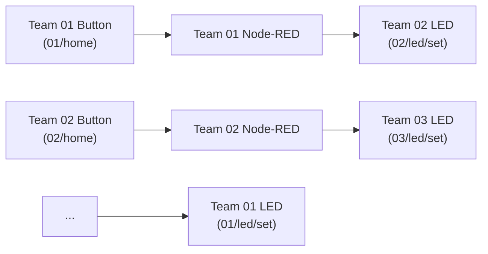
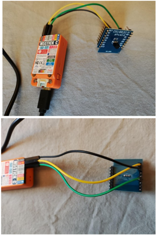
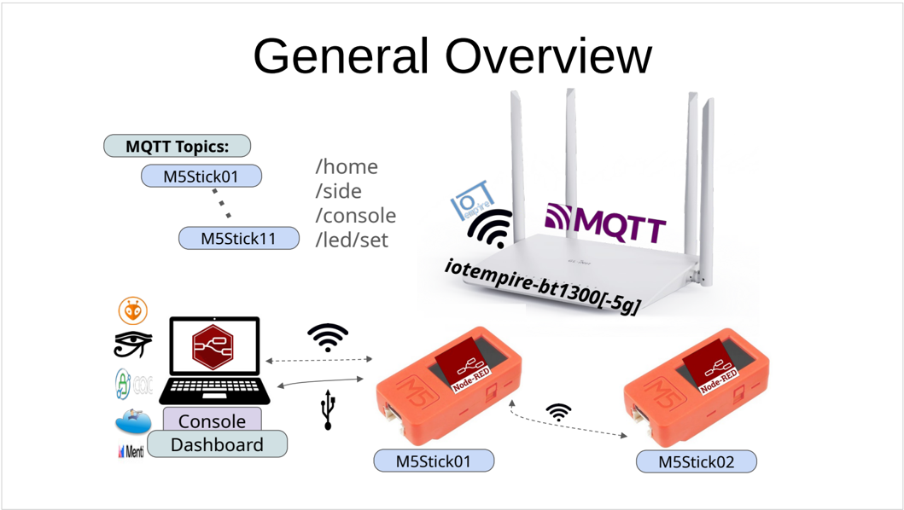

# Mastering IoT Solutions – Hands-On Workbook

[Overview & Learning Outcomes](./workshop-overview.md) | [Instructor Guide](./INSTRUCTOR-GUIDE.md)

Welcome to the **Mastering IoT Solutions** hands-on lab! This workbook is your interactive companion during the session.

---

## Team Setup & Working Style

You will work in **teams of two (or three)**:
- 🧭 **The Navigator:** Keeps this workbook open, guides the tasks, tracks pinouts and MQTT topics, and takes quick notes/photos for the portfolio.
- 💻 **The Driver:** Operates the laptop connected to the workshop network, builds the data flows in Node-RED, and tests live messages.
- 🔄 **Rotate roles freely** during the workshop so everyone gets hands-on experience with both hardware and visual programming!

> [!TIP]
> **Pacing is flexible:** You do not need to wait for everyone before moving to the next step. Tasks may be introduced orally by the instructor or explored self-paced through this workbook. If you finish core tasks early, jump straight into the [Open-Ended Explorations](#-open-ended-explorations)!

---

## Phase 1: First Contact & Hello World in Node-RED

### 1. Connect to the Workshop Network
Connect your laptop or tablet to the workshop Wi-Fi:
- **SSID:** `iotempire-b1300-5g` *(recommended for laptops; if your device does not support 5 GHz, use `iotempire-b1300`)*
- **Password:** `iotempire`

### 2. Open Your Team's Node-RED Instance
Each team has a private, isolated Node-RED instance running in a container on the instructor's presentation host:
- **URL:** `http://<instructor-host>:18nn/` *(or `http://<instructor-ip>:18nn/` where `nn` is your team number, e.g. `1801` for Team 01; check the slide for the exact host address)*
- **Username:** `admin`
- **Password:** Check the projector screen or ask your instructor (e.g. `iotempireXX`)

### 3. Your First Flow: Inject -> Debug
1. Find the **inject** node in the left palette and drag it onto the canvas.
2. Find the **debug** node and drag it next to the inject node.
3. Click and drag a wire from the output port (right side) of **inject** to the input port (left side) of **debug**.
4. Double-click the **inject** node, set the payload dropdown to **string**, and type `"Hello IoT!"`. Click **Done**.
5. Click the red **Deploy** button in the top-right corner.
6. Click the small square button on the left edge of your inject node.
7. Open the **Debug sidebar** (the small bug icon 🪲 on the right panel). You should see your message arrive!

---

## Phase 2: Interacting with Your M5StickC

Your instructor will hand you an **M5StickC** pre-programmed with [IoTempower](https://iotempower.us). Check the two-digit number displayed on its screen (e.g. `01`, `02`, `14`). This is your **Stick ID** (`<id>`).

```
             +-----------------------+
             |      [TFT Screen]     |
             |       M5StickC        |
             |     [ M5 Button ]     |  <-- "home" button
             +-----------------------+
                [Right Side Button]     <-- "buttom" button
```

### 1. Listen to Stick Buttons
1. Drag an **mqtt in** node onto the canvas.
2. Double-click it:
   - **Server:** Select `Classroom Broker` (or enter `broker.internal` / gateway IP, port `1883`).
   - **Topic:** `<id>/home` *(replace `<id>` with your stick number, e.g. `01/home`)*.
3. Wire it to a **debug** node and click **Deploy**.
4. Press the large front **M5** button on your stick. Watch `"pressed"` and `"released"` appear in your debug sidebar!
5. *Bonus:* Create another **mqtt in** node for `<id>/buttom` to listen to the smaller right-side button.

### 2. Remote Control: Toggle the Onboard LED
1. Drag an **inject** node onto the canvas. Double-click it, select **string**, and set the payload to `"toggle"`.
2. Drag an **mqtt out** node onto the canvas. Set its topic to `<id>/led/set` (e.g. `01/led/set`).
3. Connect the inject node to the mqtt out node and click **Deploy**.
4. Click the inject button -> Look at your M5StickC: the small red LED toggles on and off!

### 3. Send Text to the Stick's TFT Display
1. Create another **inject** node with string payload: `"Coffee Time!"` (or your team name).
2. Wire it to an **mqtt out** node with topic `<id>/console/set` (e.g. `01/console/set`).
3. Deploy and trigger the node -> The text prints live on your microcontroller's screen!

---

## ⚡ Phase 3: The Classroom Domino Chain

Now let's connect your stick to your neighbors' sticks across the room!



1. In your Node-RED canvas, take your **mqtt in** node listening to your own button (`<id>/home`).
2. Wire it into a **switch** node configured to check:
   `property: msg.payload == "pressed"`
3. Wire the switch output to a **change** node configured to:
   `set msg.payload to "toggle"`
4. Wire the change node to an **mqtt out** node pointing to **your neighbor's stick** (e.g. if you are Team 01, send to `02/led/set`; if you are the last team, wrap around to `01/led/set`).
5. Click **Deploy**.
6. When everyone is ready, press your button -> Watch the pulse of light ripple across all tables in the room!

---

## 🌡️ Phase 4: Adding the Dallas Temperature Sensor & Live OTA

Let's turn your stick into an environmental sensing station.

### 1. Hardware Wiring
Carefully wire your **Dallas DS18B20** temperature sensor to the top 8-pin header of the M5StickC:



| M5StickC Top Header Pin | Dallas Sensor Pin | Wire Color (Typical) |
|---|---|---|
| **GND** | **GND** | Black / Blue |
| **5V** (or **3V3**) | **VCC** | Red |
| **G26** | **DATA** / **D2** | Yellow / White |

> [!IMPORTANT]
> Always verify GND and power pins before plugging in! Make sure the data pin is connected to **G26**.

### 2. Over-The-Air (OTA) Deployment
How does the stick know a temperature sensor is connected?
In [IoTempower](https://iotempower.us), the entire hardware definition for a sensor is just **one single line of declarative C++**:
```cpp
ds18b20(temp, 26);
```
- Tell your instructor that your sensor is wired.
- The instructor uncomments that line in your stick's configuration and deploys it **Over-The-Air (OTA)** over Wi-Fi.
- Watch your stick screen: it reboots and reconnects within seconds—**no USB flashing cable required!**
- Create an **mqtt in** node subscribing to `<id>/temp` (e.g. `01/temp`) and wire it to a debug node. You will now see live Celsius temperature readings stream in every few seconds!

---

## 📊 Phase 5: Building a Live Dashboard

Now let's build an interactive user interface using **Dashboard 2.0** (`@flowfuse/node-red-dashboard`):



### 1. Gauge & Live Chart
1. In the left palette, scroll down to the **Dashboard 2.0** section.
2. Drag a **ui-gauge** and a **ui-chart** node onto the canvas.
3. Wire your `<id>/temp` mqtt in node to both the gauge and the chart.
4. Double-click the gauge node:
   - Set the range from `15` to `40` °C.
   - Label it `"Room Temperature"`.
5. Click **Deploy**.
6. Open your dashboard in another browser tab:
   `http://<instructor-host>:18nn/dashboard/` *(or `http://<instructor-ip>:18nn/dashboard/`)*.
7. Pinch the Dallas sensor head with warm fingers and watch the needle rise and the history line chart draw live!
Update course curriculum and workshop documentation - minor refinements
### 2. Classroom Heatmap (Wildcard Aggregation)
Want to know if one corner of the room is warmer than another?
1. Add an **mqtt in** node with topic: `+/temp` *(the `+` is an MQTT single-level wildcard meaning "any stick")*.
2. Wire it into a **function** node with this small script to label the data series:
   ```javascript
   const parts = msg.topic.split('/');
   msg.topic = 'Stick ' + parts[0];
   msg.payload = parseFloat(msg.payload);
   return msg;
   ```
3. Wire the function output into a **ui-chart** node.
4. Deploy and check your dashboard: you now see a multi-line comparison of all teams in the room!

---

## Open-Ended Explorations

Done with the basics? Pick any of these challenges to explore further:

### Option A: Indoor Air Quality with Sensirion SCD4x (CO2)
If an SCD4x I2C sensor is available at your station:
- Wire it to pins `G26` (SDA) and `G0` (SCL).
- Ask the instructor to enable `scd4x(gas).i2c(26,0);` via OTA.
- Subscribe to `<id>/gas/co2` (ppm), `<id>/gas/temp`, and `<id>/gas/humidity`.
- Build a traffic-light indicator in Node-RED: Green (<800 ppm), Yellow (800–1200 ppm), Red (>1200 ppm, open windows!).

### Option B: Orientation & Motion Gestures (IMU)
Your M5StickC has an onboard 6-axis IMU (MPU6886).
- Subscribe to `<id>/imu/pitch` and `<id>/imu/roll`.
- Tilt the stick and observe the angle values in Node-RED.
- Challenge: Build a "digital level" or trigger an alarm message when the stick is flipped upside down.

### Option C: Screen Customization & Rotation
- Look into your stick's display commands.
- Send multi-line status reports or emoji characters to `<id>/console/set`.
- Explore what happens when you send commands to change text size or invert colors.

### Option D: Automation & Telegram Bot Bridge
- In Node-RED, install `node-red-contrib-telegrambot` or use an HTTP Request node.
- Configure a flow so that when your team's button is held down or temperature exceeds 28°C, a notification is sent directly to your phone via Telegram or Webhook.

### Option E: Deep Dive into IoTempower Documentation
- Browse the official framework site: [iotempower.us](https://iotempower.us).
- Inspect how simple it is to add RFID readers, RGB LED matrices, relays, and servo motors using the same fluent syntax.

---

## On-Demand Reference & Concepts

> *Read this section whenever you are curious about what is happening under the hood!*

### What is MQTT?
**MQTT (Message Queuing Telemetry Transport)** is a lightweight publish/subscribe protocol designed for low-bandwidth, high-latency, or unreliable networks:
- **Broker:** The central post office (e.g. Mosquitto). Nodes do not talk directly to each other; they only talk to the broker.
- **Publish:** Sending data to a specific topic (e.g. `01/temp` -> `22.4`).
- **Subscribe:** Telling the broker you want to receive any messages published to a topic (e.g. listening to `01/home`).
- **Wildcards:**
  - `+` matches a single hierarchy level: `+/temp` matches `01/temp`, `02/temp`, etc.
  - `#` matches all sub-levels: `01/#` matches everything published by Stick 01.

### MQTT Topic Cheat Sheet for M5StickC

| Topic | Direction | Payload Example | Meaning |
|---|---|---|---|
| `<id>/home` | Node -> Broker | `"pressed"`, `"released"` | Front 'M5' button |
| `<id>/buttom` | Node -> Broker | `"pressed"`, `"released"` | Right side auxiliary button |
| `<id>/led/set` | Node <- Broker | `"on"`, `"off"`, `"toggle"` | Turn red LED on/off/toggle |
| `<id>/led` | Node -> Broker | `"on"`, `"off"` | Current state of red LED |
| `<id>/console/set` | Node <- Broker | `"Hello!"` | Print text on stick screen |
| `<id>/temp` | Node -> Broker | `23.8` | Dallas DS18B20 temperature in °C |
| `<id>/imu/pitch` | Node -> Broker | `-5.2` | Pitch angle in degrees |

---

## 📝 University Portfolio Deliverables (Day 1)

If you are enrolled in **HSBI MCU Programming** or **UniTartu IoT Intro**, this session fulfills your **Module 1 Practical Work Report**:

1. **Snapshots to capture:**
   - [ ] Photo of your physical M5StickC wired to the Dallas temperature sensor on your desk.
   - [ ] Screenshot of your Node-RED flows (Ping-Pong, Domino, and Dashboard).
   - [ ] Screenshot of your live Dashboard 2.0 gauge and temperature curve.
2. **Where to write:**
   - In your personal GitHub portfolio repository under `Module-01/` (or `Day-01/`).
3. **What to reflect upon:**
   - What worked immediately on first try?
   - What friction occurred (e.g. wiring, topic syntax, Wi-Fi)?
   - How did the peer interaction / domino chain feel compared to writing standalone code?
   - Your key insight about event-driven architectures and edge frameworks.
